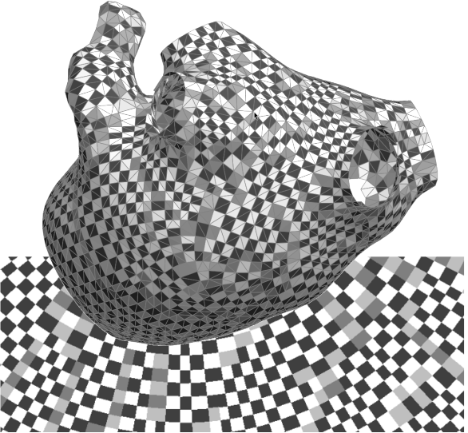
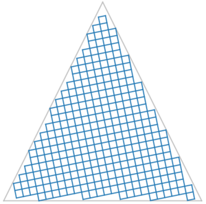

### Objective

The aim of this python package is to generate a surface mesh composed of interconnected cables constructed from evenly-spaced streamlines parallel and orthogonal to a given orientation field on the surface (an oriented manifold). The lengths of the edges in the resulting mesh generally vary between 0.7 and 1.4 times the target resolution (dx). The application that motivated this developement is the simulation of electrical propagation in a cardiac tissue (the figure above shows a left atrium) [1].

The algorithm and its applications are discussed in our paper [2]. The implementation relies on our evenly-spaced streamline generation method [3] available on github ([evenlyspacedstreamlines](https://github.com/jacquemv/evenlyspacedstreamlines)).

### Minimal example

```python
import numpy as np
import matplotlib.pyplot as plt
from orthogonalstreamlines import create_orthogonal_streamlines_mesh

ver = np.array([[0, 0, 0], [1, 0, 0], [0.5, 1, 0]])
tri = np.array([[0, 1, 2]])
orient = np.array([[np.cos(0.2), np.sin(0.2), 0]])
mesh = create_orthogonal_streamlines_mesh(ver, tri, orient, 0.05)

plt.triplot(ver[:, 0], ver[:, 1], triangles=tri, c='0.75')
for cable in mesh.cables:
    plt.plot(mesh.vertices[cable, 0], mesh.vertices[cable, 1], c='C0')
plt.show()
```



### Syntax

```python
mesh = create_orthogonal_streamlines_mesh(
    vertices, triangles, orientation, dx,
    nb_seeds=1024, options=None,
    random_seed=None, verbose=True, 
    add_ghost_nodes=False, unit='cm'
)
```

### Positional arguments

The arguments **vertices** and **triangles** define the triangulated surface, and **orientation** the vector field on that surface. The parameter **dx** specifies the target resolution.
- **vertices** (nv-by-3 array): x, y, z coordinates of the nv vertices of type numpy.float64
- **triangles** (nt-by-3 int array): indices of the vertices of the nt triangles of type numpy.int32
- **orientation** (nt-by-3 array): orientation vector in each triangle
- **dx** (float or tuple): target mesh resolution in the same unit as 'vertices'; if dx is a tuple, resolution is different in the longitudinal (first value) and transverse direction (second value).

### Optional keyword arguments

- **nb_seeds** (int): number of seed points for streamline generation (default: 1024)
- **options** (dict): additional arguments passed to the function evenly_spaced_streamlines
- **random_seed** (tuple of int): set random seed for streameline generation; there is one seed for longitudinal streamlines and one for transverse streamlines
- **add_ghost_nodes** (bool): add the vertices of the streamlines to the cables; these "ghost" nodes are intended to facilitate visualization and create curves instead of segments between consecutive nodes of the cable, but they are not evenly spaced (default: False)
- **verbose** (bool): print informations during computations (default: True)
- **unit** (str): unit of distance in the input mesh (used only for displaying information); default: 'cm'

### Outputs

**mesh** is a ```namedtuple``` containing the following fields:
- **cables** (list of int arrays): each cable is represented by an array of vertex indices; longitudinal cables are listed first
- **nlc** (int): number of longitudinal cables
- **ntc** (int): number of transverse cables
- **dx** (float array of size ne): length of each edge
- **vertices** (nv-by-3 float array): cable vertex positions
- **triangles** (nt-by-3 int array): new triangulation of the surface
- **facets** (list of int arrays): facets[n] is a k-by-n array whose k rows are facets with n sides boundaries (list of int arrays): boundaries[n] is the array of vertex indices of the n-th boundary or hole
- **ver_to_orig_tri** (int array of size nv): maps cable vertices to triangle indices from the original triangulated surface
- **tri_to_facet** (int array of size nt): maps triangle indices to facet indices
- **neighbors** (nv-by-4 int array): indices of up to 4 neighboring vertices of each vertex; the first two columns are for neighbors in the longitudinal direction, the next two columns for the transverse direction; index is -1 where there is no neighbor
- **sign** (int array of size nv): sign (with respect to the vector normal to the surface) of the cross product of the tangent vectors of the streamlines at their intersection random_seed (tuple of int): random seeds used for streamlines generation
- **is_node** (int array of size nv): is_node[k] = 0 if the vertex k is a ghost node, and 1 otherwise
- **info** (dict): internal information about the calculations

### Installation

The package can be installed using the command ``pip install orthogonalstreamlines`` (on Windows, a compiler such as Microsoft Visual C++ is required).

If the code is downloaded from github, local installation on Linux is done by running ``make local`` and including the directory 'orthogonalstreamlines' in the PYTHONPATH environment variable.

Tested using Anaconda 2023.09 (python 3.11) on Linux and Windows.

### Acknowledgements

The algorithm includes code for the triangulation of polygons: [polypartition](https://github.com/ivanfratric/polypartition/tree/master) by Ivan Fratric and [earcut](https://github.com/mapbox/earcut.hpp/tree/master) from Mapbox (see license information in the directory orthogonalstreamlines/triangulation).

This work was supported by the Natural Sciences and Engineering Research Council of Canada (NSERC grant RGPIN-2020-05252).

### References

1. E. J. Vigmond, R. Ruckdeschel, N. Trayanova. [Reentry in a morphologically realistic atrial model](https://pubmed.ncbi.nlm.nih.gov/11577703/). *J. Cardiovasc. Electrophysiol.* 2001, vol. 12, no. 9, pp. 1046–54.

2. E. Zakeri-Zafarghandi, V. Jacquemet. [Automatic construction of interconnected cable models of cardiac propagation on a surface](). *In preparation* 2025.

3. V. Jacquemet. [Improved algorithm for generating evenly-spaced streamlines on a triangulated surface](https://www.sciencedirect.com/science/article/pii/S0169260724001986),  *Comput. Methods Programs Biomed.* 2024. vol 251, pp. 108202. [[Open access link]](https://www.sciencedirect.com/science/article/pii/S0169260724001986)